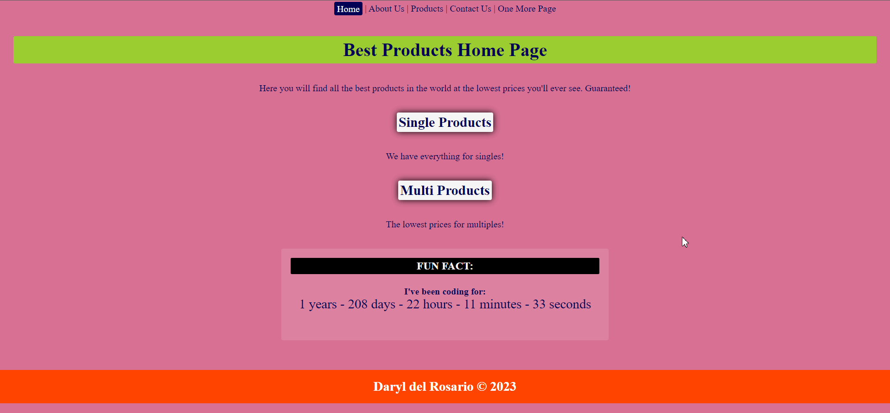

# Adding Website and Files to Github via CO
First introduction to git and github via instructions from CO.

## <a href="https://daryldelrosario.github.io/co-usegithub_pro-five/">Live Demo</a>

<kbd></kbd>

## Features
- SEO components in the <code>&lt;head&gt;&lt;head/&gt;<code>
    - title tag
    - meta description
- JavaScript component that counts the time that has passed since I first started learning how to code
    - Started August 1st, 2021

### Requirements

    
&#10004; Personal website with correct file structure on local machine

- [x] one <a href="https://daryldelrosario.github.io/co-usegithub_pro-five/index.html">index.html</a> page
    - contains meta tags and all HTML documents linked appropriately
- [x] three other pages linked
    - <a href="https://daryldelrosario.github.io/co-usegithub_pro-five/about-us.html">about-us.html</a>
    - <a href="https://daryldelrosario.github.io/co-usegithub_pro-five/contact-us.html">contact-us.html</a>
    - <a href="https://daryldelrosario.github.io/co-usegithub_pro-five/products/products.html">products.html</a>
    

    
EXTENDED

    - <a href="https://daryldelrosario.github.io/co-usegithub_pro-five/one-more.html">single-products.html</a>
    - <a href="https://daryldelrosario.github.io/co-usegithub_pro-five/products/multiple-products.html">multiple-products.html</a>
    

- [x] one css and one optional javascript file
    - <a href="https://github.com/daryldelrosario/co-usegithub_pro-five/blob/main/css/main.css">main.css</a>
    - <a href="https://github.com/daryldelrosario/co-usegithub_pro-five/blob/main/js/main.js">main.js</a>

- [x] At least two images on any page of your choice
    - <a href="https://daryldelrosario.github.io/co-usegithub_pro-five/one-more.html">Image One</a>
    - <a href="https://daryldelrosario.github.io/co-usegithub_pro-five/products/multiple-products.html">Image Two</a>
    

    
&#10004; Upload and host website to GitHub

- <a href="https://daryldelrosario.github.io/co-usegithub_pro-five/">Live Demo deployed via Github</a>

    
&#10004; Add one more additional page

- <a href="https://daryldelrosario.github.io/co-usegithub_pro-five/one-more.html">one-more.html</a>

    
&#10004; Change color and bold a sentence using pull and merge commands

- <code>p element</code> with black background and white text on <a href="https://daryldelrosario.github.io/co-usegithub_pro-five/one-more.html">One More Page</a>
- <a href="https://github.com/daryldelrosario/co-usegithub_pro-five/pull/1">Merged and Pulled via GitHub</a>

    
&#10004; Invite Collaborators through their GitHub username

- Invited TA <a href="https://github.com/uzairdanish">@uzairdanish</a>

